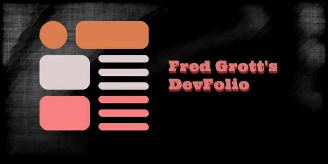

# fredgrotts_devfolio

A walk on the best practices side of creating websites using Flutter, i.e. a developer and designer portfolio website. 

Design and Content is under my commerical copyright. Code is under a BSD-clause-3 license. So take the graphics and design and modify for your own website.

## Processes

### Design Procsses

Brand Logo of site was kept to a very specific simple core:

Typography is composed of font pairings of Titillium Web and Montserrat Alternate

## Articles

App design and development articles at my medium blog:

[my medium blog](https://fredgrott.medium.com)

## Find Me On Social

Find me on these social platforms:

[behance](https://www.behance.net/gwsfredgrott)

[dribbble](https://dribbble.com/FredGrott)

[github](https://github.com/fredgrott)

[hacker news](https://news.ycombinator.com/user?id=fredgrott)

[keybase](https://keybase.io/fredgrott)

[linkedin}(https://www.linkedin.com/in/fredgrottstartupfluttermobileappdesigner/)

[medium](https://fredgrott.medium.com)

[twitter](https://twitter.com/fredgrott)

[xing](https://www.xing.com/profile/Fred_Grott/cv)

[youtube](https://www.youtube.com/channel/UCRQadYlHQ8DKRQ_WwUrfZ_w)

